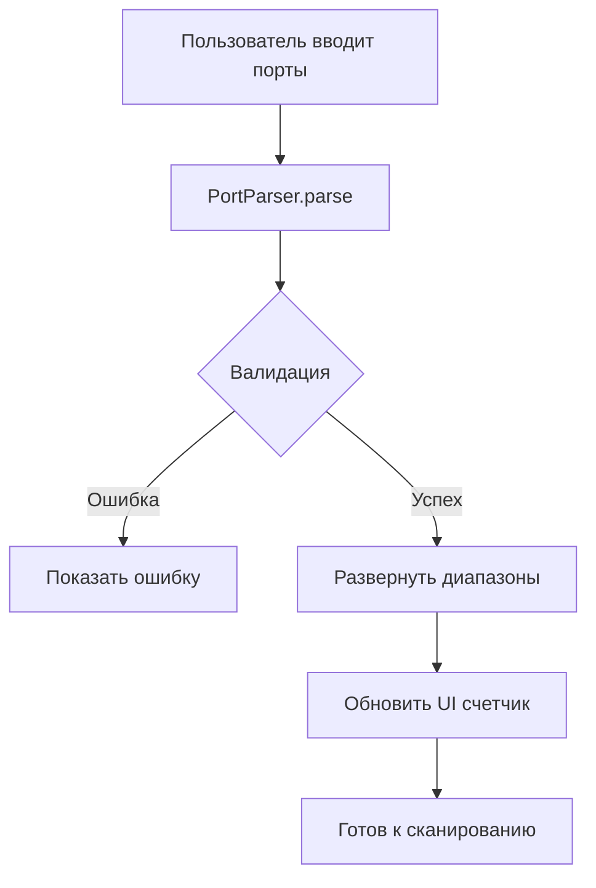
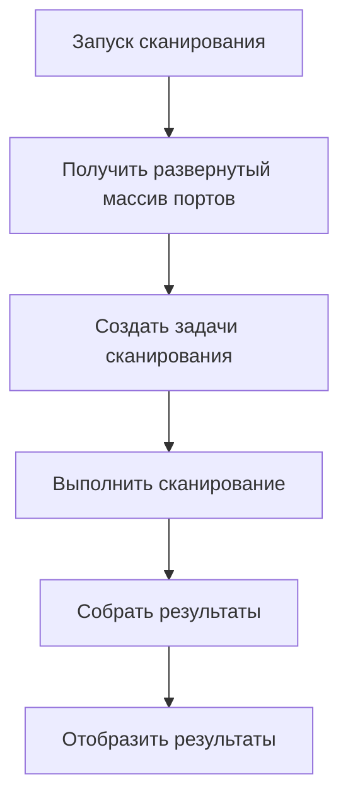

# Design Document

## Overview

Расширение функциональности MacPortScanner для поддержки сканирования диапазонов портов. Система будет парсить входные данные, поддерживая как отдельные порты (22,80,443), так и диапазоны (22-443), а также их комбинации.

## Architecture

### Frontend Components (React)
- **PortInputField**: Расширенное поле ввода с валидацией диапазонов
- **PortPresets**: Выпадающий список предустановленных диапазонов
- **PortCounter**: Компонент отображения количества портов
- **ValidationMessage**: Компонент для отображения ошибок валидации

### Backend Logic (Electron Main Process)
- **PortParser**: Класс для парсинга строк с портами и диапазонами
- **PortValidator**: Валидация корректности портов и диапазонов
- **PortExpander**: Развертывание диапазонов в массивы портов

## Components and Interfaces

### PortParser Class
```typescript
interface PortRange {
  start: number;
  end: number;
}

interface ParsedPorts {
  individual: number[];
  ranges: PortRange[];
  expanded: number[];
  total: number;
}

class PortParser {
  static parse(input: string): ParsedPorts;
  static expandRanges(ranges: PortRange[]): number[];
  static validatePort(port: number): boolean;
  static validateRange(start: number, end: number): boolean;
}
```

### PortInputField Component
```typescript
interface PortInputProps {
  value: string;
  onChange: (value: string, parsed: ParsedPorts) => void;
  onValidationChange: (isValid: boolean, errors: string[]) => void;
}

interface PortInputState {
  isValid: boolean;
  errors: string[];
  portCount: number;
  showWarning: boolean;
}
```

### Предустановленные диапазоны
```typescript
const PORT_PRESETS = {
  popular: "22,80,443,3389",
  webServers: "80-90,443,8000-8080,8443",
  databases: "3306,5432,1433,27017,6379",
  mailServers: "25,110,143,993,995",
  allPorts: "1-65535"
};
```

## Data Models

### Расширение ScanRequest
```typescript
interface ScanRequest {
  target: string;
  ports: number[]; // Развернутый массив всех портов
  portInput: string; // Оригинальная строка ввода
  scanType: 'single' | 'range';
  timeout?: number;
  method?: 'tcp' | 'syn' | 'udp';
  portCount: number; // Количество портов для UI
}
```

### Валидация
```typescript
interface ValidationResult {
  isValid: boolean;
  errors: string[];
  warnings: string[];
  portCount: number;
}
```

## Error Handling

### Типы ошибок валидации
1. **InvalidPortNumber**: Порт не является числом или вне диапазона 1-65535
2. **InvalidRange**: Начальный порт больше конечного
3. **TooManyPorts**: Более 1000 портов в одном запросе
4. **EmptyInput**: Пустое поле ввода
5. **InvalidFormat**: Неправильный формат (например, "22--80")

### Обработка ошибок
```typescript
class PortValidationError extends Error {
  constructor(
    message: string,
    public code: string,
    public field?: string
  ) {
    super(message);
  }
}
```

## Testing Strategy

### Unit Tests
1. **PortParser.parse()**: Тестирование парсинга различных форматов
2. **PortValidator**: Валидация корректных и некорректных входных данных
3. **PortExpander**: Развертывание диапазонов в массивы

### Integration Tests
1. **Frontend + Backend**: Полный цикл от ввода до сканирования
2. **UI Validation**: Реакция интерфейса на различные входные данные
3. **Performance**: Время парсинга больших диапазонов

### Test Cases
```typescript
describe('PortParser', () => {
  test('парсит отдельные порты', () => {
    expect(PortParser.parse('22,80,443')).toEqual({
      individual: [22, 80, 443],
      ranges: [],
      expanded: [22, 80, 443],
      total: 3
    });
  });

  test('парсит диапазоны', () => {
    expect(PortParser.parse('22-25')).toEqual({
      individual: [],
      ranges: [{start: 22, end: 25}],
      expanded: [22, 23, 24, 25],
      total: 4
    });
  });

  test('парсит комбинированный ввод', () => {
    expect(PortParser.parse('22,80-83,443')).toEqual({
      individual: [22, 443],
      ranges: [{start: 80, end: 83}],
      expanded: [22, 80, 81, 82, 83, 443],
      total: 6
    });
  });
});
```

## Implementation Flow

### 1. Парсинг входных данных


### 2. Процесс сканирования


## UI/UX Design

### Поле ввода портов
- Автодополнение с предустановками
- Валидация в реальном времени
- Цветовая индикация (зеленый/красный)
- Счетчик портов под полем

### Предупреждения
- Желтое предупреждение при >100 портах
- Красное предупреждение при >1000 портах
- Модальное окно подтверждения для >1000 портов

### Примеры использования в UI
```
Порты: [22,80-90,443,8000-8080        ] [▼]
       ✓ Портов для сканирования: 25

Предустановки:
- Популярные (22,80,443,3389)
- Веб-серверы (80-90,443,8000-8080)
- Базы данных (3306,5432,1433,27017)
```